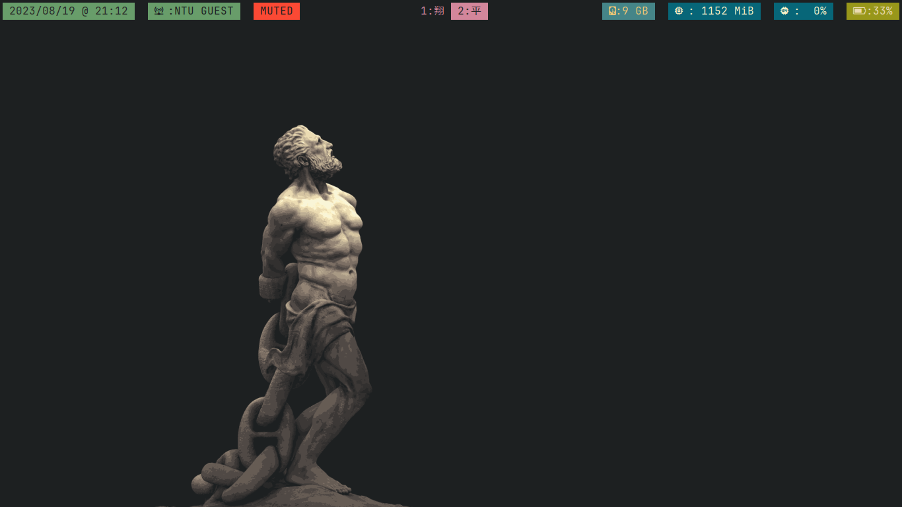

#CONFIG FILES FOR MY *UNIX SYSTEM.

##SOME EXTRA PACKAGES USED:
1.[Nerdfonts](https://github.com/ryanoasis/nerd-fonts)
2.[gruvbox color palette](https://github.com/morhetz/gruvbox)
3.[neovim](https://github.com/neovim/neovim) as well as [vim-plug](https://github.com/junegunn/vim-plug)
4.[i3-wm](https://github.com/i3/i3)
5.[rofi](https://github.com/davatorium/rofi), as well as [rofi-power-menu](https://github.com/jluttine/rofi-power-menu/blob/master/rofi-power-menu)
6.[polybar](https://github.com/polybar/polybar)
7.[zathura](https://github.com/pwmt/zathura), as well as [zathura-pdf-mudpdf](https://github.com/pwmt/zathura-pdf-mupdf)
8.[kitty](https://github.com/kovidgoyal/kitty) terminal
9.[starship.rs](https://github.com/starship/starship)
10.[zsh](https://www.zsh.org/) and [lsdeluxe](https://github.com/lsd-rs/lsd)
Thank you to all the creators and contributors of these projects for making this happen!
