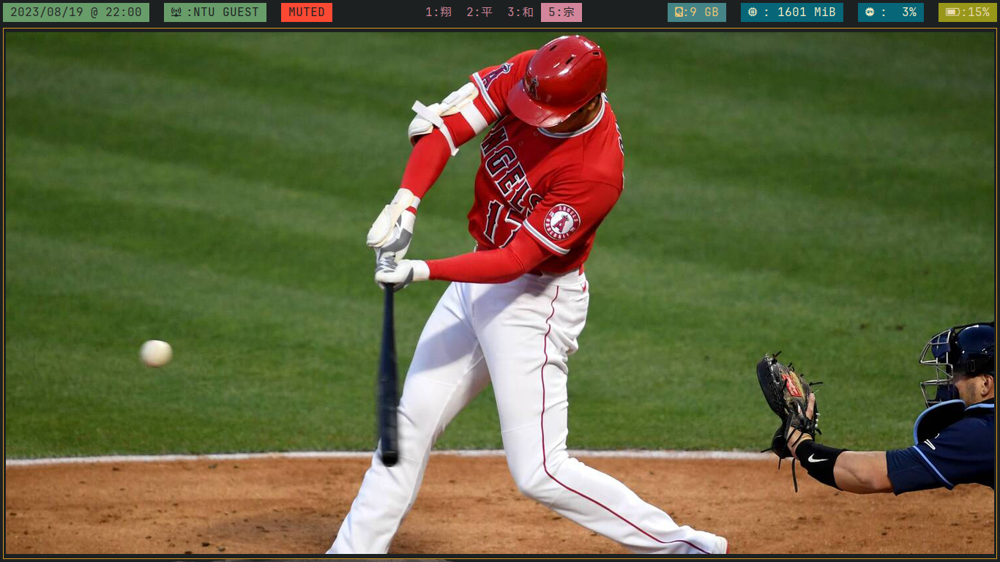

# [CONFIG FILES](https://en.wikipedia.org/wiki/Configuration_file#Unix_and_Unix-like_operating_systems) FOR MY [*LINUX](https://en.wikipedia.org/wiki/GNU/Linux_naming_controversy) SYSTEM.

> SYSTEM INFORMATION:
1. OS: Arch Linux [(BTW)](https://archlinux.org/).
2. Laptop: [ThinkPad X270](https://www.lenovo.com/lt/lt/laptops/thinkpad/x-series/ThinkPad-X270/p/22TP2TX2700?orgRef=https%253A%252F%252Fwww.google.com%252F).
3. Runs on tea and human effort.

## SOME EXTRA PACKAGES USED:

1. [Nerdfonts](https://github.com/ryanoasis/nerd-fonts)
2. [gruvbox color palette](https://github.com/morhetz/gruvbox)
3. [neovim](https://github.com/neovim/neovim) as well as [vim-plug](https://github.com/junegunn/vim-plug)
4. [i3-wm](https://github.com/i3/i3)
5. [rofi](https://github.com/davatorium/rofi), as well as [rofi-power-menu](https://github.com/jluttine/rofi-power-menu/blob/master/rofi-power-menu)
6. [polybar](https://github.com/polybar/polybar)
7. [zathura](https://github.com/pwmt/zathura), as well as [zathura-pdf-mudpdf](https://github.com/pwmt/zathura-pdf-mupdf)
8. [kitty](https://github.com/kovidgoyal/kitty) terminal
9. [starship.rs](https://github.com/starship/starship)
10. [zsh](https://www.zsh.org/) and [lsdeluxe](https://github.com/lsd-rs/lsd)

**Thank you to all of the creators and contributors of these projects**
##2023/08/24 @ 17:58 README.md version. Future updates to be determined.

